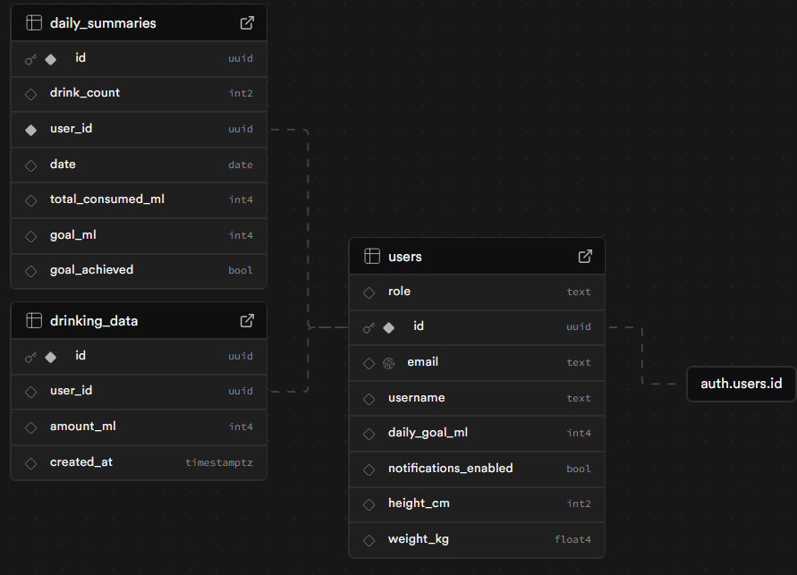

# SWPM - Smart Water Bottle
An intelligent water bottle system for monitoring and promoting healthy drinking habits. 

## Project Overview
The Smart Water Bottle System consists of an ESP32-based hardware solution with flow sensor and display, a backend for data management and user analysis, plus a frontend for android phones created with Flutter.

### Main Features

- **Automatic Water Volume Detection** via flow sensor
- **Visual Feedback** through round TFT display (240x240px)
- **Smart Reminders** with color-coded LEDs
- **Bluetooth Communication** between hardware and backend
- **User Profiles** with individual daily goals
- **Daily Summaries** and progress tracking
- **Cross-Platform Mobile App** for Android
- **Real-time Hardware Sync** via Bluetooth Low Energy
- **Interactive Dashboard** with progress visualization and quick actions
- **Detailed Analytics** with daily charts

## Development
### Prerequisites
#### Configure Supabase:
   - Create a new project on Supabase.
   - Set up the database schema as per the [Supabase schema](./database_schema.sql).
   

### Commit Convention

This repository uses [Conventional Commits](https://www.conventionalcommits.org/) to maintain a consistent and readable commit history. Please follow the format below when making commits.

#### Types

- **API or UI relevant changes**
  - `feat` Commits, that add or remove a new feature to the API or UI
  - `fix` Commits, that fix an API or UI bug of a preceded `feat` commit

- `refactor` Commits, that rewrite/restructure your code, however do not change any API or UI behaviour
  - `perf` Commits are special `refactor` commits, that improve performance

- `style` Commits, that do not affect the meaning (white-space, formatting, missing semi-colons, etc)

- `test` Commits, that add missing tests or correcting existing tests

- `docs` Commits, that affect documentation only

- `build` Commits, that affect build components like build tools, dependencies, project version, ci pipelines, ...

- `ops` Commits, that affect operational components like infrastructure, deployment, backup, recovery, ...

- `chore` Miscellaneous commits e.g. modifying `.gitignore`

#### Examples

- `feat(frontend): add user authentication`
- `fix(backend): resolve database connection timeout`
- `docs: update API documentation`
- `refactor(hardware): optimize sensor reading logic`
- `perf(backend): improve database query performance`
- `test(frontend): add unit tests for login component`
- `build: update webpack configuration`
- `chore: update .gitignore`

## 🔗 Links

- [Backend Documentation](./backend/README.md)
- [Hardware Documentation](./embedded/README.md)
- [Frontend Documentation](./swpm_flutter_app/README.md)