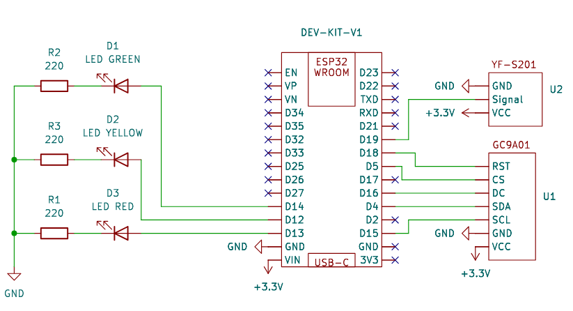

# Smart Water Bottle - Hardware (ESP32) Documentation
The Smart Water Bottle hardware is based on the ESP32 microcontroller, which provides Bluetooth Low Energy (BLE) capabilities for communication with the mobile app. The hardware includes a flow sensor to detect water intake and a display to provide user feedback.
## Hardware Components
- **Microcontroller**: ESP32 DevKit V1
- **Display**: GC9A01 (240x240 round TFT)
- **Flow Sensor**: YF-S201
- **LEDs**: Status display (Green/Yellow/Red)

### Schematic



## Development Environment
The hardware is developed using PlatformIO, which provides a convenient environment for programming the ESP32.
## Setup Instructions
1. **Install PlatformIO**: Follow the [PlatformIO installation guide](https://docs.platformio.org/en/latest/installation.html).
2. **Clone the Repository**:
   ```bash
   git clone https://github.com/kvnlnk/swpm-smart-water-bottle.git
   cd swpm-smart-water-bottle/embedded
   ```
3. **Open in PlatformIO**: Open the `ESP32_Smart_Water_Bottle` folder in PlatformIO.
4. **Configure the Environment**: Ensure the `platformio.ini` file is set up
    with the correct board and framework settings for the ESP32.
5. **Install Dependencies**: Use the PlatformIO command to install the required libraries:
   ```bash
   pio lib install
   ```
6. **Build the Project**: Compile the code to ensure there are no errors:
   ```bash
    pio run
    ```
7. **Connect the ESP32**: Connect your ESP32 board to your computer via USB.
   Ensure the correct COM port is selected in PlatformIO.

8. **Upload the Code**: Use the PlatformIO upload command to flash the firmware to the ESP32 board:
   ```bash
   pio run -t upload
   ```


